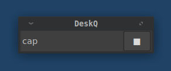
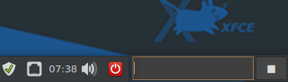
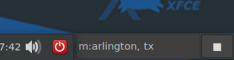

# DeskQ
Desktop command-line utility (Python version)
for Linux, (Windows, MacOS)

The purpose of DeskQ is to provide a way to access or start stuff  
from one place on your desktop. It's a **"command-line menu."**

DeskQ is a windowless entry field that you position on your desktop.  
You can do these things with it:  
* Save URLs and recall them later
* Save text from the clipboard and access later
* Start an Internet search (keeps history)
* Set up searches for specific services (like: Google Maps)
* Set up commands to launch programs, documents, or URLs
* ...

------
## Installing DeskQ
Python 3.5 or greater must be present on your system.
Copy all files into a folder.
To execute:
: python deskq.py (Linux)
: deskq.pyw (Windows)
: deskq (x86 Linux only)

---
Deskq for Linux uses the Gtk3 GUI. 
Deskq for Windows uses the tkinter GUI.

---

You will need to configure DeskQ to run on startup for your OS.  
With the caption on you can position the window.  

To reposition use the `cap` command to toggle the  
window caption bar on and off. The `winset` command saves  
the windows geometry and caption status.  
  
  
*Here I've positioned Deskq along side the xfce panel.*  

To use DeskQ you type something into the entry field.  
Below is a list of the possibilities.  

| command/text | action/description |
| :----- | :---- |
|_a URL_|saves URL to a list|
|_search text_|starts a search in browser|
|**sc** or _action button_|saves clipboard contents|
|**list**|opens dialog with list of saved URLs|
|**hist**|opens dialog with list of saved search texts|
|**eval:**_maths_|places result in clipboard and search box|
|**cap**|toggles window caption bar|
|**winset**|saves window size/position settings|
|**eu**|edit saved URL list (urls.lst)|
|**ec**|edit saved clips text (clips.txt)|
|**eh**|edit saved search history (hist.csv)|
|**es**|edit custom command / services file (services.csv)|
|**ee**|edit name of your text editor|
|**help**|view this help|
|**up/down arrow** keys|recall last command or search text|

---

_Use the **`hist`** command to pop up a dialog of your  
saved searches._  

## System commands and web services

In `services.csv` you can set up custom searches and 
local commands to run programs.  
Use `es` to edit `services.csv` file. 

The `services.csv` file holds your custom commands and links.  
The entries in `services.csv` basically takes two forms:
* ### commands  
  Commands can be either URLs or system commands.  
  The first character of each line must begin with  
  either a "$"  ";" or "."  
  The general format is:  
  $*command-you-will-type*, URL | fullpath/command-line  
  
  #### examples:  
    `$git,https://github.com`  
    `;dev,dev.sh`  
    `;shutdown,shutdown now`  
    `.reboot,reboot`  
  
  
  To access these commands in Deskq you could type any  
  of the following .. and hit Enter or click the action button.  
  
   
  | you type | resulting action |
  | :---------- | :-------------------- |
  |`$git`|opens github.com in your browser|  
  |`.dev`|executes your shell script to ... ?|  
  | `.shut`|shuts down your machine| 
  |`;shutdo`|shuts down your machine| 
  |`$sh`|shuts down your machine| 
  |`;reboot`|reboots your machine|
  |`;reb`|reboots your machine|
  
  As shown it helps to order your commands assending which  
  should allow for unique substrings as your commands  
  become familiar from use.  
  
* ### Search in web services with custom querystrings  
  These must be URLs with a ?querystring.  
  The first character of each line must begin with  
  a single letter (a-z, 1-0). They cannot begin with  
   "$"  ";" or ".".  
  The general format is:  
  *?,name,website-URL + left-side-of-query-string=*  
  #### examples:  
  `a,Amazon,https://smile.amazon.com/s/ref=nb_sb_noss_1?field-keywords=`
  
  `i,Google Images,http://images.google.com/images?q=` 
  
  `p,Php,http://php.net/manual-lookup.php?pattern=` 
  
  Use these like this:  
  
  `a:mini computers`  
  `i:wallpaper for Linux Mint`  
  `p:preg_split`  
  
  
  
  It may take a little work to discover some of these querystrings but many do exist.  

### Save and recall URLs and text clippings.

To save a URL copy (or select and drag, linux only) it into DeskQ and hit Enter.  
To view and re-open saved URLs type **`list`** into DeskQ and hit Enter.  

To save text that you've copied into your system clipboard just type **`sc`**  
or click the action button.  
To view/edit text you've saved just type **`ec`** Enter.  
Your text editor will pop-up with all of your clippings.

 
#### You specify the text editor
Before you start using DeskQ edit the `editor.txt` one line file  
putting in the name to start your text editor.  
* _example:_  
  `notepad.exe`  
  `subl`  
  `gedit`  
  `xed`  
  `atom`  
  `whatever`  

#### List of DeskQ System Files

| |  |
| ----- | ----- |
|`clips.txt`|text file of clippings|
|`deskq.glade`|used by deskq.py |
|`deskq.py`|DeskQ main source|
|`hist.txt`|text file of search history|
|`serv.txt`|text file of $ commands and special querys|
|`winmet.txt`|window geometry ...|
|`edit.txt`|name of your text editor program|
|`urls.txt`|text file of saved URLs|
|`seaq.txt`|querystring to search with you favorite search engine|

#### end

  
